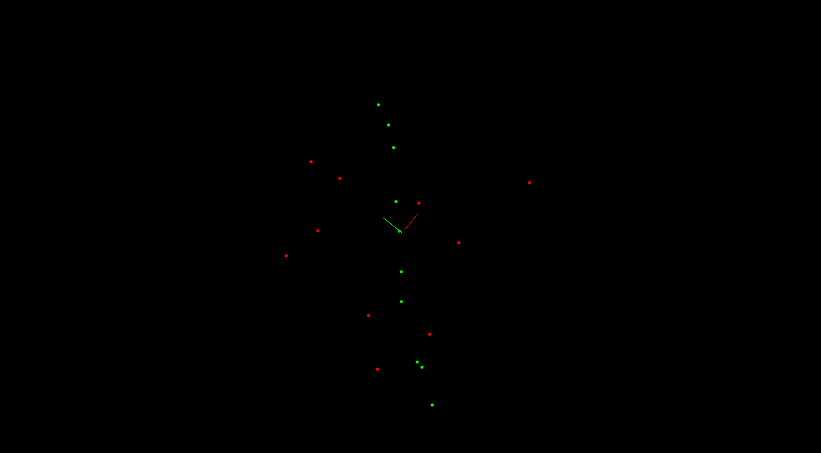
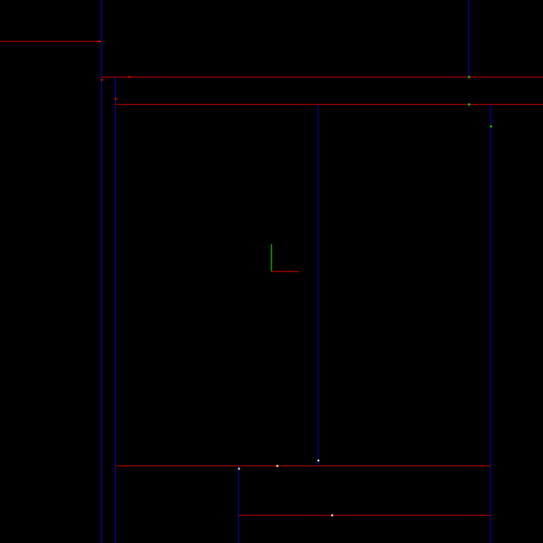

# Sensor Fusion Udacity Nano-degree
## Obstacles Detection:

* Lidar sensing gives us high resolution data by sending out thousands of laser signals. These lasers bounce off objects, returning to the sensor where we can then determine how far away objects are by timing how long it takes for the signal to return. Also we can tell a little bit about the object that was hit by measuring the intesity of the returned signal. Each laser ray is in the infrared spectrum, and is sent out at many different angles, usually in a 360 degree range. While lidar sensors gives us very high accurate models for the world around us in 3D, they are currently very expensive, upwards of $60,000 for a standard unit.
* In this project, real lidar point cloud data stream is processed in order to detect obstacles as shown in the following GIFs.

* Scene:

  


* Output:

 	


## Data processing pipeline:

  

### Downsampling
* Reduce the number of points in a data set with the PCL [voxel_grid](https://pcl.readthedocs.io/en/latest/voxel_grid.html).
* Hyperparameter:
  * Voxel size.

### Filtering
* Extract the region of interest using PCL [CropBox](https://pointclouds.org/documentation/classpcl_1_1_crop_box_3_01pcl_1_1_p_c_l_point_cloud2_01_4.html) filter.
* Hyperparameters:
  * Min. & Max. vectors.

### Segmentation
* Segment the data into to clouds namely obstacles cloud, and road cloud.
  * Custom implementation of segmenting 3D and 2D data with RANSAC.
The implementation for 3D data can be found [here](https://github.com/HatemSelim94/Lidar_Obstacle_Detection/blob/master/src/processPointClouds.cpp#L99), and 2D data can be found [here](https://github.com/HatemSelim94/Lidar_Obstacle_Detection/blob/master/src/quiz/ransac/ransac2d.cpp#L64).

  * [PCL segmentation](https://pcl.readthedocs.io/projects/tutorials/en/latest/planar_segmentation.html#planar-segmentation) with [RANSAC](https://en.wikipedia.org/wiki/Random_sample_consensus) can be found [here](https://github.com/HatemSelim94/Lidar_Obstacle_Detection/blob/master/src/processPointClouds.cpp#L179).
* Segmentation pseudocode and results can be found [here](https://github.com/HatemSelim94/Lidar_Obstacle_Detection/tree/master/src/quiz/ransac).
  * 2D

    
  * 3D
  	
    

* Hyperparameters:
  * Distance tolerance.
  * Max. number of RANSAC iterations.


### Clustering
* Form clusters from the obstacles cloud.
  * Custom implementation of Euclidean clustering with kd-tree.
    * The implementation For 2D data can be found [here]().
    * The implementation For 3D data:
       * 3D tree can be found [here](https://github.com/HatemSelim94/Lidar_Obstacle_Detection/blob/master/src/KDTree.cpp).
       * Euclidean clustering can be found [here](https://github.com/HatemSelim94/Lidar_Obstacle_Detection/blob/master/src/processPointClouds.cpp#L267)
  * [PCL clustering](https://pcl.readthedocs.io/projects/tutorials/en/latest/cluster_extraction.html#cluster-extraction) with kd-tree data structure can be found [here](https://github.com/HatemSelim94/Lidar_Obstacle_Detection/blob/master/src/processPointClouds.cpp#L217).
* Clustering pseudocode and results can be found [here](https://github.com/HatemSelim94/Lidar_Obstacle_Detection/tree/master/src/quiz/cluster).

* Clustering with 2d tree visualization:
  
  	
* Hyperparameters:
  * Distance threshold.
  * Min. & Max. number of points to form a cluster.

### Bounding boxes
* Place bounding boxes around the individual clusters


### Custom implementation performance
* The average processing time of a point cloud with 120000 data points is 70 ms.

  

## Installation

### Ubuntu

* Download and run the install file.
```bash
	./installFile.sh
```
or
```bash
sudo apt install libpcl-dev
cd ~
git clone https://github.com/HatemSelim94/Lidar_Obstacle_Detection
cd SFND_Lidar_Obstacle_Detection
mkdir build && cd build
cmake ..
make
./environment
```
