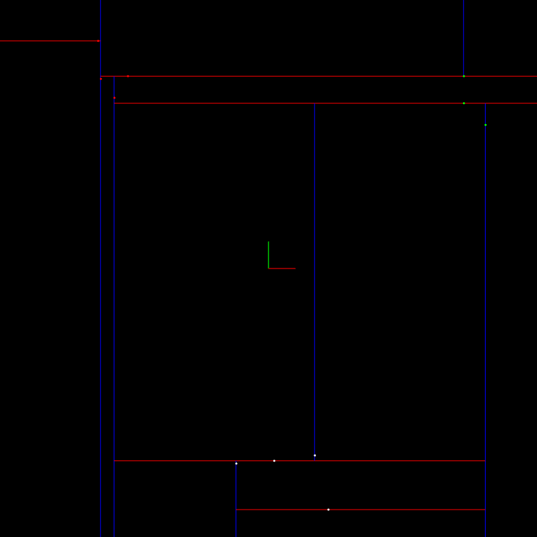

### Clustering:
* [Clustering](https://en.wikipedia.org/wiki/Cluster_analysis) in general is the task of grouping a set of objects in such a way that objects in the same group are similar to each other than those in other groups.


#### [K-D-Tree](https://en.wikipedia.org/wiki/K-d_tree):
* It is a space-partitioning data structure for organizing points in a k-dimensional space.
* The benefit of using a k-d Tree in clustering is to search and identify clusters efficiently.
###### [Construction](https://youtu.be/LdaL-l2S76c):
  * The construction can be summarized to three steps:
pick, divide, repeat.
    1. Pick:
      * Pick a point randomly or choose the median.
    2. Divide:
      * Divide the space along the i<sup>th</sup> axis, where i is the depth % no. of axes.
    3. Repeat:
      * Repeat the steps.

  ###### Consider the case of a 2d-tree:

  - The root of the tree will the first chosen point at level 0.
  - Each point is a node and has right and left node.
  - While inserting points, Whether the new point(t) will go left or right, it depends on the value along the axis at which the node(p) splits the space. If point (p) splits the x-axis,
  then if x<sub>t</sub> >= x<sub>p</sub> then point (t) goes right, or left otherwise.
  - If a node is empty while inserting points then, the point is assigned to this empty node.
  - Stop if all points are processed.

  ###### Searching:
  - Traversing the tree by either going left or right is done by checking if value of xt >= xp then you go right, otherwise go left. Where t is the target point and p is the node which splits the space along the x-axis at this level.

  - Searching for nearby points to a point (t) is done by traversing the tree, narrowing down the possible candidates with the distance threshold.

#### Euclidean Clustering:
  * Uses the euclidean distance between the target point and the neighboring candidates as the check condition while searching for nearby points to form a cluster.
  * Check if the number of points forming a cluster lies within the threshold.
  ###### Pseudo-code:

  ```
  Proximity(point,cluster):    
      mark point as processed
      add point to cluster
      nearby points = tree(point)
      Iterate through each nearby point
        If point has not been processed
         Proximity(point,cluster)
      ```
    ```
    EuclideanCluster():
      list of clusters
      Iterate through each point
          If point has not been processed
              Create cluster
              Proximity(point, cluster)
              cluster add clusters
      return clusters
    ```

#### Hyperparameters:
  1. Distance threshold.
  2. Maximum number of points to form a cluster.
  3. Minimum number of points to form a cluster.

#### Result:
As shown in the following image, the 2d-tree with the space splited by each point and there are three clusters found and labeled in red, green, and white.

 
