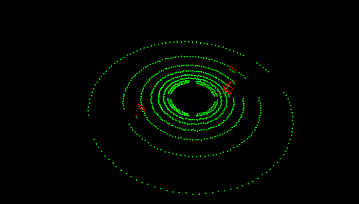
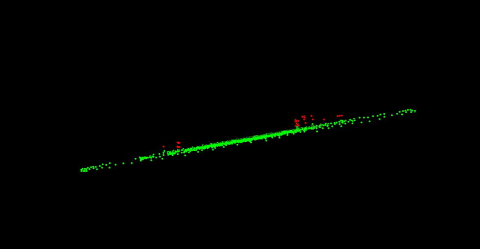
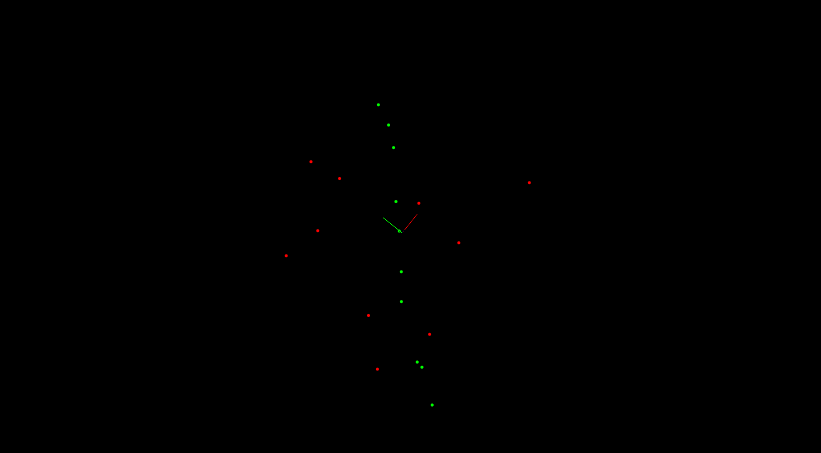

# Segmentation of LIDAR point cloud data:
* Splits the cloud into two clouds, one represents the inliers and the other represents the outliers.
* The algorithm used is [RANSAC](https://youtu.be/BpOKB3OzQBQ).

## 3D/2D [RANSAC](https://youtu.be/BpOKB3OzQBQ):
RANSAC stands for Random Sample Consensus, and is a method for detecting outliers in data. RANSAC runs for a max number of iterations, and returns the model with the best fit.

#### Implementation:
  * Iterate over the algorithm n times, where n is the maximum number of iterations.
    1. Randomly pick a number of different points that represent the model.
      - In case of 2D, two points are enough to represent a line.
      - In case of 3D, three points are selected to represent a plane.
    2. Form a plane.
    3. For each point in the cloud:
      - Add the index of the point to the inliers indices if the distance between the point and the model(line/plane) is less than the distance threshold.
    4. Save the indices if the number of points realized by the constructed model is larger than that of the current best model.

##### Hyperparameters:
  1. Maximum number of iterations.
  2. Distance threshold.

##### Remarks on performance:
  * The larger the Number of iteration, the more accurate the segmentation will be.  
  * The computation time compared to one of the built-in PCL segmentation is almost the same for a simple point cloud data.

### Results:
* The outliers are the red points and they represent obstacles in 3D data.
  * 3D:

    

    
  * 2D:

      
